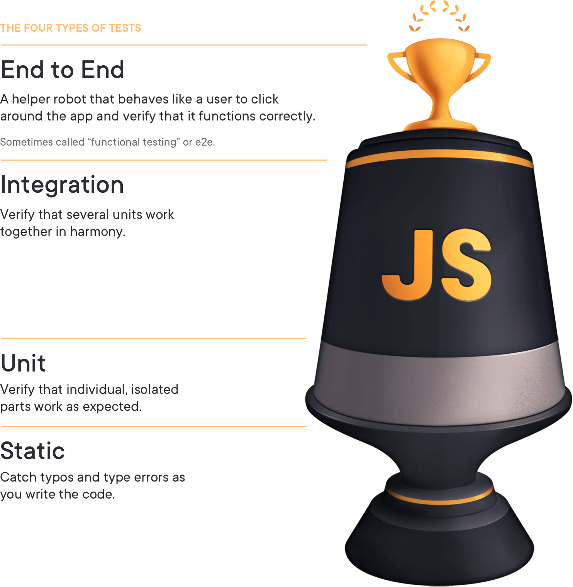

<!-- PROJECT SHIELDS -->
[![Stargazers][stars-shield]][stars-url]
[![Issues][issues-shield]][issues-url]
[![LinkedIn][linkedin-shield]][linkedin-url]

<!-- PROJECT LOGO -->
 

  

  <h3 align="center">JavaScript Testing</h3>

  

    This is the playground for me to do testing practice using JavaScript
     
    <a href="https://github.com/aindrajaya/javascript-testing"><strong>Explore the docs »</strong></a>
     
     
    <a href="https://github.com/aindrajaya/javascript-testing">View Demo</a>
    ·
    <a href="https://github.com/aindrajaya/javascript-testing/issues">Report Bug</a>
    ·
    <a href="https://github.com/aindrajaya/javascript-testing/issues">Request Feature</a>
  

<!-- TABLE OF CONTENTS -->

  
Table of Contents

  <ol>
    <li>
      <a href="#about-the-project">About The Project</a>
      <ul>
        <li><a href="#built-with">Built With</a></li>
      </ul>
    </li>
    <li>
      <a href="#getting-started">Getting Started</a>
      <ul>
        <li><a href="#prerequisites">Prerequisites</a></li>
        <li><a href="#installation">Installation</a></li>
      </ul>
    </li>
    <li><a href="#roadmap">Roadmap</a></li>
    <li><a href="#contact">Contact</a></li>
    <li><a href="#acknowledgements">Acknowledgements</a></li>
  </ol>

<!-- ABOUT THE PROJECT -->
## About the Counter dApps (Decentralized Applications)
### Built With
This projects is built with
* [JavaScript](https://www.javascript.com/)

<!-- GETTING STARTED -->
## Getting Started

<!-- ROADMAP -->
## Roadmap

<!-- CONTACT -->
## Contact
Arista - [@Arista_Indra](https://twitter.com/Arista_Indra) - arista.indrajay@gmail.com

Project Link: [JavaScript Testing](https://github.com/aindrajaya/javascript-testing)

<!-- ACKNOWLEDGEMENTS -->
## Acknowledgements

<!-- MARKDOWN LINKS & IMAGES -->
<!-- https://www.markdownguide.org/basic-syntax/#reference-style-links -->
[stars-shield]: https://img.shields.io/github/stars/aindrajaya/javascript-testing.svg?style=for-the-badge
[stars-url]: https://github.com/aindrajaya/javascript-testing/stargazers
[issues-shield]: https://img.shields.io/github/issues/aindrajaya/javascript-testing.svg?style=for-the-badge
[issues-url]: https://github.com/aindrajaya/javascript-testing/issues
[linkedin-shield]: https://img.shields.io/badge/-LinkedIn-black.svg?style=for-the-badge&logo=linkedin&colorB=555
[linkedin-url]: https://www.linkedin.com/in/aindrajaya
[product-screenshot]: images/screenshot.png